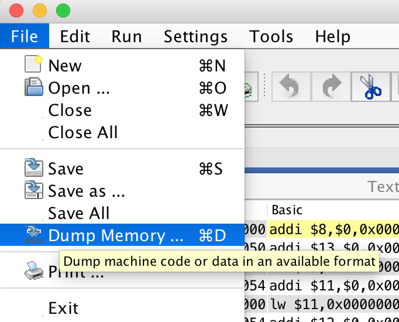
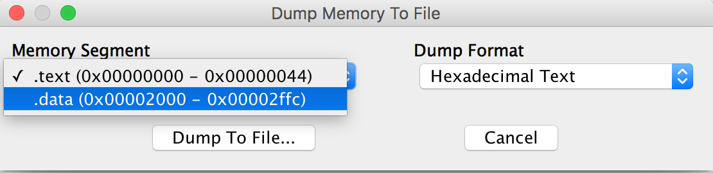
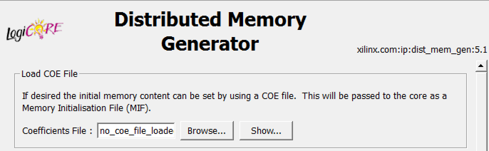
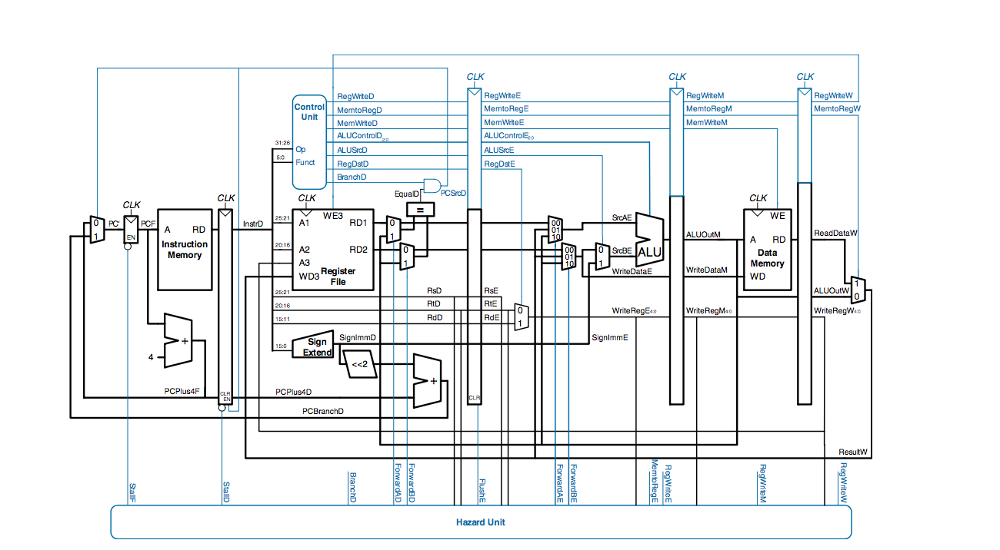

##mipscpu
This is source code of the pipeline cpu written in verilog.

### Supported instructions:

* add addi addu sub subu
* and andi or ori nor xor xori
* sllv srlv srav slt sltu slti sltiu lui
* beq bne bgtz bgez bltz blez j jr
* lw sw

### Feature:

* support pipeline
* support downloads to NEXYS3

### Instructions:

* Use [**MARS(a mips simulator)**](http://courses.missouristate.edu/KenVollmar/mars/) to dump the mips assembler code into hexadecimal machine code. 

  

  ​

  You need to get the text segment code and data segment code.

  

* make use of text.hex and data.hex to initialize the *ise distributed memory generator*. You have to first transform the hex file into [coe file format](https://www.xilinx.com/itp/xilinx10/isehelp/cgn_r_coe_file_syntax.htm)

  

* generate bit file for download or use ISim to simulate it.

### BluePrint

The blueprint of my mipscpu is nearly the same as the figure below(except I added a branch unit).

The graph is quoted from [**Digital Design and Computer Architecture**](https://www.elsevier.com/books/digital-design-and-computer-architecture/harris/978-0-12-394424-5)

